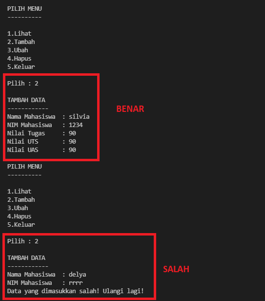
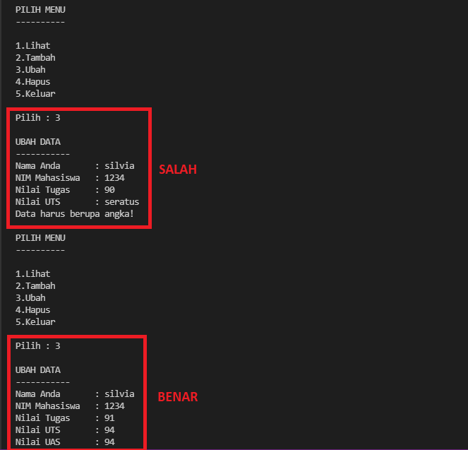
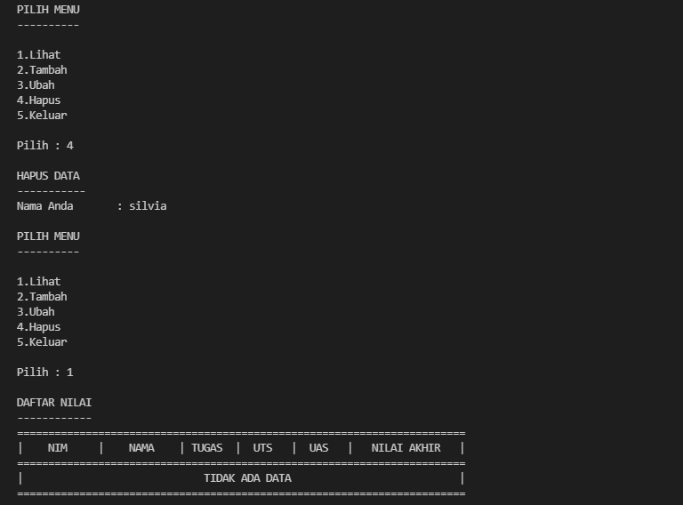
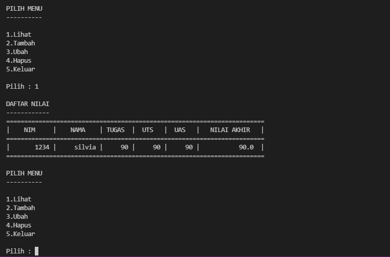
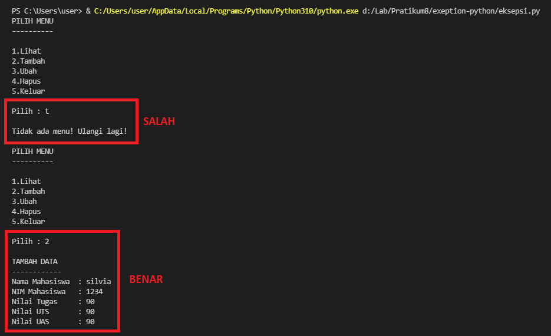

# Penanganan Eksepsi

## Latihan

>Implementasikan penggunaan eksepsi pada lab-lab sebelumnya untuk mengatasi error yang ditimbulkan.

## Penjelasan

**Eksepsi** ( exception ) : Merupakan suatu kesalahan (error) yang terjadi saat proses eksekusi program sedang berjalan, Kesalahan ini akan menyebabkan program berakhir dengan tidak normal.

**Blok Try and Except :**
* Setiap kode program yang memungkinkan terjadinya eksepsi, maka
perlu untuk di tempatkan di dalam blok **try** .
* Ketika ada kesalahan, maka kode di blok **except** akan dieksekusi.
* Jika program tidak memiliki kesalahan, maka blok except
akan diabaikan.

Disini saya menggunakan program pada lab sebelumnya, yaitu program daftar nilai mahasiswa. Yang terdiri dari beberapa fungsi seperti tambah data, ubah data, hapus data dan lihat data. 

### Tambah Data

* Fungsi `def tambah()` berfungsi untuk menginput variable nama, nim, nilai tugas, nilai uts dan nilai uas. 
* Apabila data yang diinputkan salah, maka kode `except` akan dijalankan.

```python
    def tambah():
    print("TAMBAH DATA")
    print("------------")
    try :
        nama = input("Nama Mahasiswa\t: ")
        nim = int(input("NIM Mahasiswa\t: "))
        tugas = int(input("Nilai Tugas\t: "))
        uts = int(input("Nilai UTS\t: "))
        uas = int(input("Nilai UAS\t: "))
        akhir = (tugas*30/100) + (uts*35/100) + (uas*35/100)
        data[nama] = [nim, tugas, uts, uas, akhir]
        print()

    except ValueError :
        print("Data yang dimasukkan salah! Ulangi lagi!")
        print()
```
### Output Tambah Data



### Ubah Data

* Fungsi `def ubah()` berfungsi untuk mengubah data berdasarkan nama.
* Apabila data yang diinputkan salah, maka kode `except` akan dijalankan.

```python
    def ubah():
    if len(data) <= 0:
        no_data()
    else :
        print("UBAH DATA")
        print("-----------")
        try :
            nama = input("Nama Anda\t: ")
            if nama in data.keys():
                nim = int(input("NIM Mahasiswa\t: "))
                tugas = int(input("Nilai Tugas\t: "))
                uts = int(input("Nilai UTS\t: "))
                uas = int(input("Nilai UAS\t: "))
                akhir = (tugas*30/100) + (uts*35/100) + (uas*35/100)
                data[nama] = [nim, tugas, uts, uas, akhir]
                print()
                
        except ValueError :
            print("Data harus berupa angka!")
            print()
```
### Output Ubah Data



### Hapus Data

* Fungsi `def hapus()` berfungsi untuk menghapus data berdasarkan nama, jika data tidak ada maka akan menjalankan fungsi `no_data()`. 

```python
    def hapus():
    if len(data) <=0:
        no_data()
    else:
        print("HAPUS DATA")
        print("-----------")
        nama = input("Nama Anda\t: ")
        if nama in data.keys():
            del data[nama]
            print()
```
### Output Hapus Data



### Lihat Data

* Fungsi `def lihat()` berfungsi untuk melihat data, jika data tidak ada maka fungsi `no_data()` akan dijalankan.

```python
    def lihat():
    if len(data) <= 0:
        no_data()
    else:
        print("DAFTAR NILAI")
        print("------------")
        print(72*"=")
        print("| {0:^10} | {1:^10} | {2:^6} | {3:^6} | {4:^6} |   {5:^12}  |".format("NIM", "NAMA", "TUGAS", "UTS", "UAS", "NILAI AKHIR"))
        print(72*"=")
        for z in data.items():
            print(f"| {z[1][0]:>10} | {z[0]:>10} | {z[1][1]:>6} | {z[1][2]:>6} | {z[1][3]:>6} |   {z[1][4]:>12}  |") 
            print(72*"=")
        print()
```
### Output Lihat Data



### Menu

* Menggunakan perulangan while dengan nilai true dan menggunakan statement try dan except.

```python
    loop = True
    while loop :
        print("PILIH MENU")
        print("----------")
        print("\n1.Lihat \n2.Tambah \n3.Ubah \n4.Hapus \n5.Keluar")
        print()
        try:
            tanya = int(input("Pilih : "))
            print()

            if tanya==1:
                lihat()
        
            elif tanya==2: 
                tambah()
        
            elif tanya==3: 
                ubah()
        
            elif tanya==4: 
                hapus()
        
            elif tanya==5:
                print("Program Selesai")
                print()
                loop = False
            
        except ValueError:
            print()
            print("Tidak ada menu! Ulangi lagi!")
            print()
```
### Output Menu



## Sekian Terimakasih